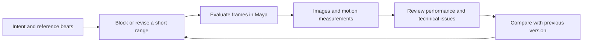

# Better animation feedback for Maya MCP

Investigation: September 14, 2026. Reviewed checkout: `1c3ab0d` (0.6.1 release fix).
Focus: character body mechanics and acting.

Implementation follow-up: the development tree now includes the animation tools
described in [the animation guide](ANIMATION.md). This document preserves the
original investigation; the guide distinguishes implemented behavior and limits.

The highest-value addition is a repeatable way to inspect an action across time,
with images and evaluated motion data aligned to the same frames. This would
let the agent connect a visible problem to the rig controls that can correct it.

For example, a landing review should show the approach, impact, compression,
recovery, and settle. It should also report whether a planted foot moves relative
to its support, which controls drive that foot, and how the edited version
compares with the previous one.

These are design recommendations based on source inspection and official
documentation. No production rig was inspected and no animation performance
benchmark was run. Proposed operation names below are not existing APIs.

The current implementation already provides useful building blocks:

| Existing capability | Evidence | Remaining need for animation |
|---|---|---|
| Single-frame viewport capture | [tools_viewport.py](../python/maya_mcp_runtime/tools_viewport.py#L530) returns color, time, units, camera matrices, and projected joints. Optional native depth is available. | An explicit frame range, chosen camera, stable framing, and correspondence across frames. |
| Combined observation | [tools_observation.py](../python/maya_mcp_runtime/tools_observation.py#L74) combines images, scoped node facts, scene mapping, and detected-coherence checks. | A bounded observation across time that reports evaluation conditions and incomplete coverage. |
| Keyframe editing and inspection | [tools_domain.py](../python/maya_mcp_runtime/tools_domain.py#L306) supports `set_keys`, `delete_keys`, and `inspect`. | Inspection returns key times and values, but not tangent geometry, layer attribution, or final evaluated movement. It takes the first 2,000 keys per plug; `time_range` currently affects deletion, not inspection. |
| Rig structure | [tools_domain.py](../python/maya_mcp_runtime/tools_domain.py#L389) exposes joint parents, positions, joint orientation, and rotation order. General node queries expose further structure. | Meaningful roles such as left foot IK, chest, eye aim, hand grip, and the controls that actually drive them. |
| Batched work and recovery | Workflows, persistent Python sessions, post-action observation, and request IDs are documented in [AGENT_LOOP.md](AGENT_LOOP.md). | Reusable animation operations, bounded capture jobs, artifact retrieval, and timing of the complete interaction. |

Arbitrary Python can prototype many missing capabilities today. Dedicated
operations would make their behavior reusable, discoverable, and easier to
verify. The existing animation writer also applies one shared key list to every
target/attribute combination. A character pose needs distinct values per plug;
workflows can express that now, but a native batch format would be clearer.

The proposed feedback loop is:

The following capabilities should be built in this order. The first three form
a useful initial release; later features can build on the same captured data.

| Priority | Functionality | Feedback it should provide | Why it helps |
|---|---|---|---|
| First | Animation capture | Labeled frame strips, individual frames, chosen views, and a synchronized manifest. | Shows pose progression, timing, spacing, and deformation. |
| First | Evaluated motion sampling | World-space landmarks, rotations, contact-relative movement, and derived speed/acceleration. | Measures movement that is ambiguous or hidden in images. |
| First | Rig and curve description | Control roles, writable channels, spaces, IK/FK state, tangents, layers, and dependencies. | Connects the problem to a precise edit. |
| Next | Focused diagnostics | Suspected sliding, penetration, pops, loop discontinuities, and unreachable poses, with evidence. | Directs attention to the frames that need review. |
| Next | Reversible edits and comparisons | Distinct keys per plug, curve edits, scoped retiming, candidate versions, and synchronized before/after evidence. | Speeds iteration and makes regressions visible. |
| Later | Performance and reference review | Reference timing, audio alignment, face/hand close-ups, acting beats, and frame-linked notes. | Improves intent, appeal, and emotional clarity. Reference intent should still be captured from the first version. |

**Capture should give the agent a readable sequence.** Start with one shot
camera and roughly 8–12 overview frames across a short action. Include key poses,
breakdowns, contacts, and intervals between keys. A sampling policy based only
on existing keys can miss a pop or overshoot. Request adjacent frames or
subframes around suspected problems. These counts are starting defaults to
benchmark, not established limits on animation understanding.

Use small, labeled sheets for an overview and larger individual images for
hands, feet, eyes, and silhouettes. Every image needs the frame, time in seconds,
camera, and candidate version in a manifest. Burn readable frame labels into
sheets as well. Dense sheets must remain expandable; fitting the whole shot
into one image can erase the details needed to assess it.

The primary view should match the intended final shot. Add a fixed side or
front view when depth, overlap, or weight transfer is ambiguous. Fit diagnostic
cameras to the action's combined bounds once; fitting each frame independently
would hide translation and change the apparent spacing. Preserve a moving shot
camera as authored and identify it clearly as distinct from diagnostic views.

Provide clean shaded and silhouette views, with optional skeletal landmarks,
foot/hand paths, and before/after pose ghosts. Keep overlays selective and
available separately from clean images. Native Maya motion trails and ghosting
are useful foundations, though their supported animation types differ.
[Autodesk's animation preview documentation](https://help.autodesk.com/cloudhelp/2027/ENU/Maya-Animation/files/GUID-1EC3357B-62DD-424F-9595-277C373D133C.htm)
describes those capabilities and limitations.

A playblast is useful for human review. The exposed Maya tools currently return
images and structured data, so the agent-facing contract should explicitly
deliver selected frames and timing data. Returning only a movie path does not
establish that the agent has inspected the motion. OpenAI documents multiple
image inputs and limitations in precise spatial reasoning, image metadata,
and resizing. Pairing images with explicit measurements follows from those
limitations; it is a design recommendation, not a documented guarantee of
animation quality. [OpenAI image input documentation](https://developers.openai.com/api/docs/guides/images-vision#limitations)

**Motion sampling should report what the rig actually does.** Sample the final
evaluated result after constraints, layers, IK, and other relevant dependencies.
Include the pelvis, chest, head, wrists, ankles, heel/toe contact markers, and
important props. Make this an explicit subset selected from a rig profile.
Do not repeatedly enumerate every joint in a large scene.

Each sample needs a canonical node identity, frame, seconds, coordinate space,
linear unit, and validity status. Include world positions and orientations,
local control values where useful, and rotations represented without Euler-wrap
ambiguity. Keep Maya's rotation order and authored channel values available for
editing. Derived velocities and accelerations must use time in seconds and
declare their finite-difference and filtering choices.

Measure foot sliding relative to the supporting surface, including moving
platforms. A planted contact requires a declared or inferred interval, support
identity, contact point, and tolerance scaled to the character. Heel and toe
markers help distinguish a legitimate foot roll from slipping. Unknown contacts
should remain unknown or low-confidence candidates.

Pelvis and chest trajectories are useful weight-transfer cues. A physically
meaningful center of mass additionally needs mass assumptions; a pelvis marker
must not be labeled as measured center of mass. Static support-polygon checks
also do not establish whether an airborne or dynamic action is plausible.

**Rig knowledge should translate intent into writable controls.** A reusable
profile should describe control roles, side and mirror relationships, neutral
pose, preferred axes, keyable channels, limits, connected drivers, IK/FK switches,
space switches, and supported matching operations. For acting, include eye aim,
eyelids, brows, mouth, and hand controls when available.

Allow profiles from the rig author, explicit user mapping, and inspected
inference. Store the provenance and confidence of each mapping. Naming guesses
should not silently become authoritative rig semantics. Start with one known
rig convention and permit explicit mappings before attempting universal rig
recognition.

Curve inspection should include curve identity, plug, time range, key values,
breakdowns, tangent types, tangent angles/weights or equivalent vectors, locks,
weighted-tangent state, infinity behavior, and layer membership. Return both
authored curves and evaluated channel samples where their meanings differ.
Tangents determine the interpolation between keys;
[Autodesk's keyTangent reference](https://help.autodesk.com/cloudhelp/2026/ENU/Maya-Tech-Docs/CommandsPython/keyTangent.html)
documents the relevant queries. Layer-specific curve resolution, layer weights,
mute, solo, override, and lock state are available through
[animLayer](https://help.autodesk.com/cloudhelp/2026/ENU/Maya-Tech-Docs/CommandsPython/animLayer.html).

**Diagnostics should locate evidence, while preserving artistic intent.** A
result should identify the affected frame interval, measured landmark, related
control where known, measurement, units, threshold, and supporting frames.
Separate a measured fact from its interpretation. For example, foot displacement
is measurable; whether it is an unwanted slip depends on the contact intention.

Useful initial checks are contact drift, ground penetration for defined contact
proxies, abrupt position/orientation changes, IK extension, and discontinuity at
a loop boundary. Check loops for position, orientation, and velocity, with a
declared policy for root motion. Large acceleration can be intentional during
an impact. A stepped blocking pass should not receive the same smoothness
expectations as polished animation. Whole-mesh collision and balance analysis
need more geometry and assumptions than a few joint samples provide.

For acting, review the order and duration of anticipation, gaze changes, body
turns, gesture accents, holds, and reactions. Technical measurements can expose
timing and unintended motion. Human preference and references remain central
to deciding whether a performance reads as hesitant, exhausted, confident, or
surprised. Avoid a single automated score that claims to measure all quality.

**Edits should produce comparable candidates.** Extend key authoring to accept
distinct keys per plug and an explicit destination layer. Add focused tangent
editing and retiming with declared frame ranges and protected contacts. Preserve
keys outside the requested edit and make each supported edit undoable.

Animation layers can support some candidate comparisons, but arbitrary rigs,
space switches, and driven channels need tested handling. For unsupported cases,
use a separate scene version. Comparisons must share the camera, framing,
lighting, timing basis, sample frames, and diagnostic settings. For retimed
variants, provide both a shared-time comparison and an explicitly beat-aligned
comparison so timing differences remain visible.

**User feedback should be easy to attach to the performance.** Capture the
character's intention, emotional change, style, duration/FPS, shot camera,
reference moments, and any protected poses or contacts. Short notes such as
“the glance should happen before the body turn” or “hold the hesitation longer
around frame 42” are more actionable than “make it better.”

Support notes on a frame or interval, with an optional body part and image
annotation. Retain accepted and rejected candidates with their reasons. For
dialogue, preserve the audio's offset and the scene's time basis; a transcript
alone does not capture delivery or pauses. Reference video should have explicit
source-to-scene timing and extracted frames where needed. It should guide the
performance without becoming an exact pixel-match target across different rigs
or cameras.

The implementation needs several reliability properties to make these features
useful. These are requirements for the proposed tools, not guarantees of the
current plugin:

- **Coherent evaluation:** capture pixels and numeric data for the same evaluated
  frame and camera. Record the requested and actual times, FPS/time unit, scene
  epoch, observed revision, rig profile version, and evaluation/cache conditions.
  Report missing or changed samples explicitly.
- **Controlled sampling:** evaluate stateful simulations sequentially with their
  required preroll or validated caches. Random access is suitable only where
  verified. Autodesk distinguishes whole-scene simulation evaluation from
  independent attribute evaluation in [bakeResults](https://help.autodesk.com/cloudhelp/2026/ENU/Maya-Tech-Docs/CommandsPython/bakeResults.html).
  Observation must not bake or overwrite animation implicitly.
- **Context restoration:** preserve the user's time, selection, active view,
  camera assignment, display settings, playback state, and auto-key state.
  Restore temporary changes even on failure. Report unsupported restoration
  or simulation-state limitations instead of implying complete isolation.
- **Honest caching:** do not treat the existing change journal as a complete
  animation cache invalidator. Maya omits attribute-change messages during
  playback and scrubbing, as documented in
  [MNodeMessage](https://help.autodesk.com/cloudhelp/2026/ENU/MAYA-API-REF/py_ref/class_open_maya_1_1_m_node_message.html).
  Use explicit resampling and conservative invalidation when coverage is uncertain.
- **Bounded delivery:** retain full sequences and samples behind retrievable
  artifact handles; return summaries, selected frames, and pages. Workflows
  currently have a 6 MiB image budget in [tools_workflow.py](../python/maya_mcp_runtime/tools_workflow.py#L19).
  Python cells additionally cap images at eight in [sessions.py](../python/maya_mcp_runtime/sessions.py#L23).
  A new capture operation must specify its own limits and incomplete-result behavior.
- **Responsive jobs:** Maya evaluation and capture remain on the main thread.
  Yield between bounded chunks and check for interruption or invalidation there.
  Encoding and analysis of copied data can run separately where safe. Existing
  request IDs provide recovery within a live session, not cancellation of an
  active Maya command.

A concrete first API slice could consist of four operations, with the first
three implemented before automated diagnosis:

| Proposed operation | Input | Bounded output |
|---|---|---|
| `maya.animation.describe` | Rig root/profile, controls, channels, time range | Verified rig mapping, animation sources, curve/layer details, editability and missing coverage |
| `maya.animation.sample` | Mapped landmarks, time range/step, evaluation policy, declared contacts | Evaluated motion artifact, sample manifest, basic derived measurements |
| `maya.animation.capture` | Sample plan, camera/view presets, review range, detail budget | Frame artifacts, labeled sheets, matching metadata, optional human-viewable playblast |
| `maya.animation.analyze` | Captured samples, contact intentions, stage/style, thresholds | Evidence-linked diagnostic candidates and unsupported checks |

Capture and sampling should share an internal evaluation path, so a workflow
can request aligned visual and numeric results without evaluating the shot twice.
Prototype capture using Maya's explicit panel/frame/image-sequence options in
[playblast](https://help.autodesk.com/cloudhelp/2026/ENU/Maya-Tech-Docs/CommandsPython/playblast.html).
Test the actual viewport, offscreen behavior, image dimensions, and host delivery
before choosing it over the current color-buffer path. Neither option should be
assumed to be faster before measurement.

There are also concrete source-level candidates for reducing overhead.
`observe` refreshes the viewport before `viewport_capture` refreshes it again.
Each capture enumerates all joints, projects up to 500 when enabled, and writes
a temporary image file before reading it for encoding. Profile these steps;
consolidate refreshes only if coherence remains correct, project the requested
landmarks, and consider memory-based encoding if disk work proves significant.
Reuse validated rig mappings while resolving their scene identities again when
needed. These are optimization candidates, not measured bottlenecks.

Validate the first slice on a short landing, a walk cycle, and an acting shot
with a gaze change and hold. Use intentionally introduced defects such as a
brief foot slide, a between-key pop, and a loop velocity discontinuity. Include
an intentional impact and moving-platform contact to check false positives.
Separately verify layered animation, IK/FK and space switches, referenced rigs,
and stateful evaluation before claiming support for them.

Measure complete request-to-review latency, Maya evaluation/draw time, readback,
encoding, transport size, and the amount of evidence sent to the model. Compare
single-frame workflows with the proposed capture path on the same scenes.
Also measure time to find an inserted defect, correct frame/control attribution,
false-positive rate, and user preference between candidate animations. Numerical
cleanup alone is not evidence of improved acting.

The first milestone should enable this interaction: capture a short landing,
identify a planted-foot problem from aligned frames and motion data, map it to
the responsible control, make a scoped correction, and compare the result under
the same review conditions. That is a concrete improvement to both animation
speed and reliability, with acting judgment supported by the same infrastructure.
